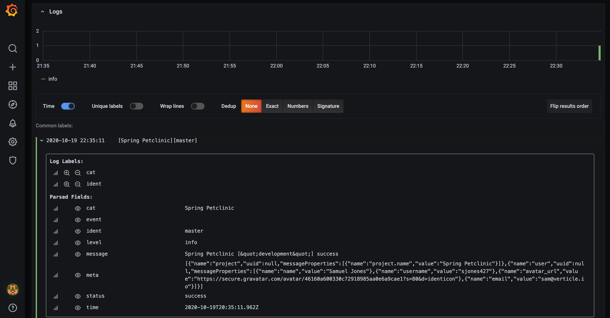
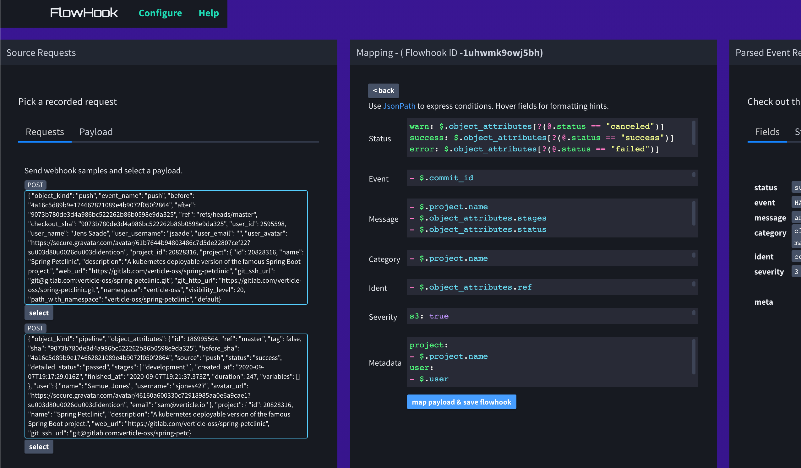

# Flowhook Datasource for Grafana

Flowhook consumes webhook payloads and maps and routes them into your Grafana Logs panel.
The Flowhook service runs on Heroku, is free and does not require any signup.

NOTE: Note this plugin is currently experimental.

## What is Grafana Data Source Plugin?

The plugin connects to the Flowhook service via websockets and forwards all incoming webhook events to the standard Grafana Logs panel. In order to pick the right data you map payloads with JsonPath selectors (Jayway implementation).

## Create a Flowhook

Head over to https://flowhook.herokuapp.com/ and follow the instructions to create a new Flowhook. Copy the ID and configure your plugin datasource to use it.

## Test the Flowhook

Now trigger a couple of webhooks and watch the contents emerge in the Logs panel or Explorer.
